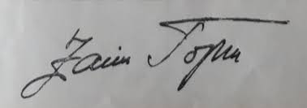

# Signature Extractor And Validator
**A service for extracting and validating handwritten signatures from photos**

#### Service supports uploading a file on the route `extract-signature` with following options:
1. Uploading a file through a form (param name **_img_**)
2. Uploading a file in base64 encoding (param name **_img64_**)
3. Uploading a file encoded as bytes (param name **_img_bytes_**)
4. Specifiying output encoding (param name **_resp_enc_**)


<br>
<br>


## There are a couple of methods for extracting signature (check `test.py` for more info)

This service uses `AdaptiveGaussianTresholdSignatureExtractor` as it performs the best

```python
import cv2
from signature_extractor import AdaptiveGaussianTresholdSignatureExtractor

img = cv2.imread("./images/original/eg0.jpeg")

se = FocusedSignatureExtractor()
sig = tex.extract_and_resize(img=img)

ok, code, msg = se.validate(sig)
if not ok:
    print(msg)

cv2.imshow("extracted_signature", sig)
cv2.waitKey(1)
```

<br>
<br>


## Examples

**Original image**
<br>


<br>

**Extracted signatures by different methods**


<br>
<br>

## TODO
**Image validation:**
- Validate if the image could be an image with a signature, not some random image:
    - A possible approach is to use color clustering to analyze color distributions within the image and use it to evaluate if the scene is significantly different and/or more complex then it should be
    -  

**Signature processing:**
- Clear-up the signature (denoising)
    - Convolve a filter to eliminate lonely pixels from signature (pixels without neighbors)
