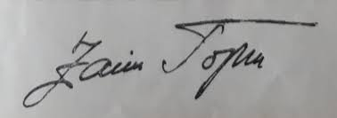
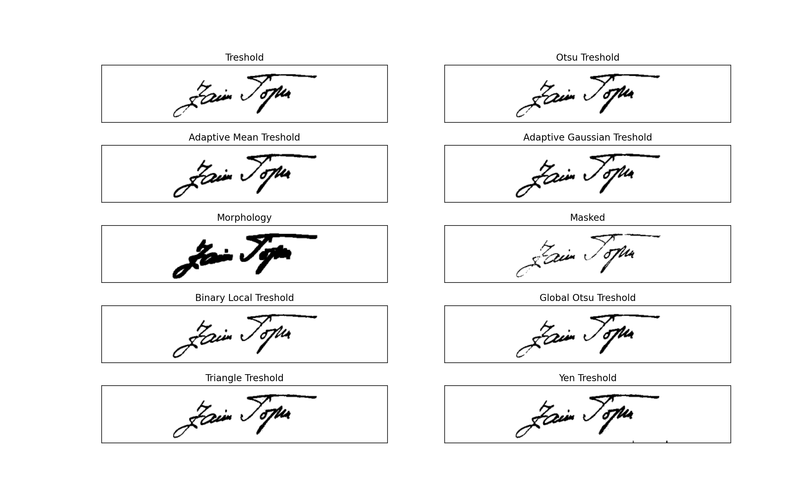

# Signature Extractor And Validator
**A service for extracting and validating handwritten signatures from photos**

#### Service supports uploading a file on the route `extract-signature` with following options:
1. Uploading a file through a form (param name **_img_**)
2. Uploading a file in base64 encoding (param name **_img64_**)
3. Uploading a file encoded as bytes (param name **_img_bytes_**)
4. Specifiying output encoding (param name **_resp_enc_**)
5. Specifiying output sizes of signature (param name **_img_sizes_**: dictionary of dimensions)

<br>

**Python request example:**
```python
import requests
import base64
import cv2
import json

url = "http://localhost:7000/extract-signature"

img = cv2.imread("./images/original/0.jpeg", cv2.IMREAD_UNCHANGED)

retval, buffer = cv2.imencode('.jpg', img)

img64 = base64.b64encode(buffer)

r = requests.post(url, json={"img64": img64.decode(), "img_sizes": {"img": (400, 70), "img_small": (300, 50)}}, timeout=2.0)

content = json.loads(r.text)

print(content)

"""
Will print a dictionary with resized images

{
    "img": "/9j/4AA...",
    "img_small": "/9j/4AA..."
}


Note: if there is an error with the image, the processed image will be returned in "img" key, with additional values in "error_code" and "message"
Example:
{
    "img": "/9j/4AA...",
    "errors": [
        {
            "error_code": "image_blurry",
            "message": "Image is blurry"
        }
    ]
}
"""


```

<br>
<br>


## There are a couple of methods for extracting signature (check `test.py` for more info)

This service uses `AdaptiveGaussianTresholdSignatureExtractor` as it performs the best

```python
import cv2
from signature_extractor import AdaptiveGaussianTresholdSignatureExtractor

img = cv2.imread("./images/original/0.jpeg")

se = FocusedSignatureExtractor()

try:
    se.pre_validate(img)
except SignatureException as e:
    print(e.error_code)

sig = tex.extract_and_resize(img=img)

sig = se.prettify(sig)

try:
    se.validate(sig)
except SignatureException as e:
    print(e.error_code)

cv2.imshow("extracted_signature", sig)
cv2.waitKey(1)
```

<br>
<br>


## Examples

**Original image**
<br>


<br>

**Extracted signatures by different methods**


<br>
<br>

## TODO
**Image validation:**
- Validate if the image could be an image with a signature, not some random image:
    - A possible approach is to use color clustering to analyze color distributions within the image and use it to evaluate if the scene is significantly different and/or more complex then it should be
    - [Image color summarizer](http://mkweb.bcgsc.ca/colorsummarizer/) [Upload form](http://mkweb.bcgsc.ca/colorsummarizer/?analyze)

**Signature processing:**
- Clear-up the signature (denoising)
    - Convolve a filter to eliminate lonely pixels from signature (pixels without neighbors)
